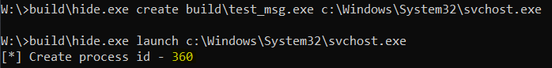
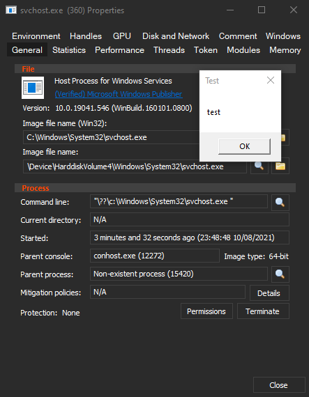

# Exec Hide
This tool can be used to "hide" an exectuable
when inspecting the process information.

It uses a simple trick with using nt path vs dos path when calling WinAPIs.
You can append spaces to the end of a nt path when using WinAPIs,
while using dos path with space at the end, it gets trimmed and therefore
the call redirect to the file without the space at the end.

Example:



__Note__:
you can see above that the command line shows nt path instead of dos path,
so it is easy to spot.
It is still possible to use dos path with this trick,
all you need to do is to call `NtCreateUserProcess`
directly instead of `CreateProcessW`,
then the space at the end doesn't get trimmed.


# How to Build
Run the `build.bat` file,
you need to have clang installed.
The version used is 12.0.0.


# Usage
```shell
usage:
        hide.exe create <source path> <target path>
        hide.exe launch <target path>
        hide.exe delete <target path>

Create command - takes the source file and output it next to the target path
Launch command - starts the process
Delete command - remove the file created on create command
```
